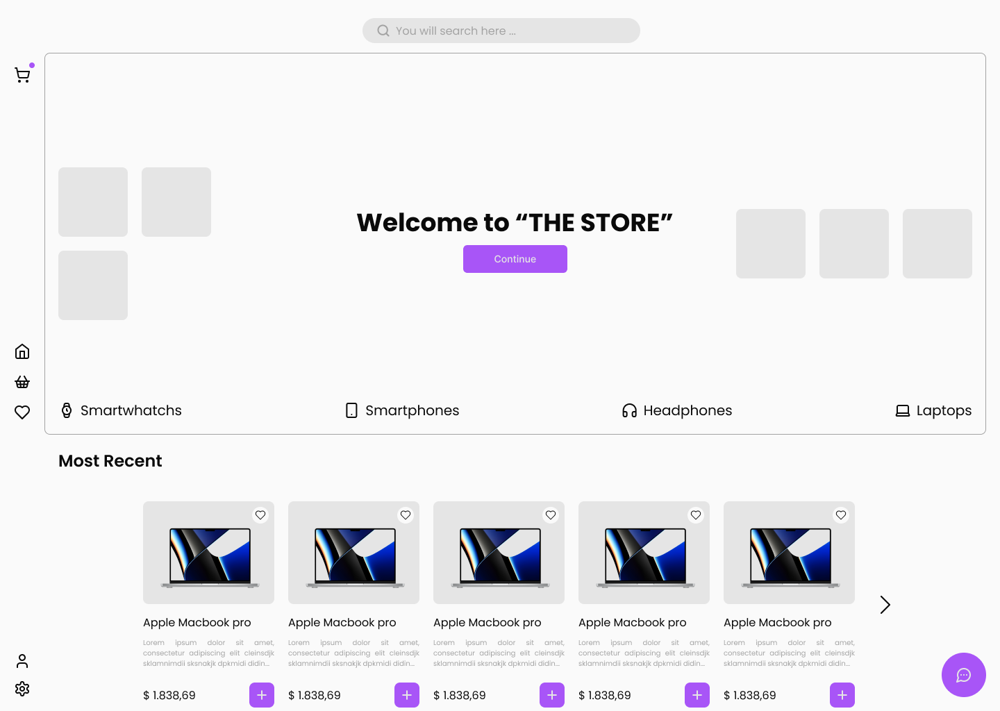

# THE STORE

  

**THE STORE** is an e-commerce project aimed at providing a complete shopping experience for Headphones, Laptops, Smartphones, and Smartwatches. The platform is being developed using the following technologies:

## Technologies

 
  
  
  
  
  
  
  
  
  
  

### Libraries
- **ShadcnUI**: Library of ready-to-use UI components, based on Tailwind CSS.
- **Biome**: Linting and formatting tool for JS.
- **Zod**: Robust and flexible data validation library.
- **React-Router-Dom**: Routing library for React.
- **react-hook-form**: Library for creating React forms with integrated validation.
- **CMDK**: Library for creating shortcuts.
- **axios**: HTTP library for making API requests.

## Features

- **Product search and filtering**: Users can search for products by name, brand, price, and other attributes.
- **Detailed product pages**: Each product has a detailed page with complete information, images, and customer reviews.
- **Shopping cart**: Users can add products to their shopping cart and securely complete their purchase.

## Objectives

- Create a pleasant and intuitive online shopping experience for customers.
- Offer a wide variety of high-quality electronic products.
- Provide exceptional customer service.
- Become the leading online electronics store.

## Technologies

The choice of technologies for the development of **THE STORE** was based on several factors, such as:

- **Performance**: The technologies used must be efficient and scalable to meet the store's demand.
- **Ease of use**: The technologies should be easy to learn and use so that developers can be productive.
- **Community**: The technologies should have a large and active community so developers can get help and support when needed.

